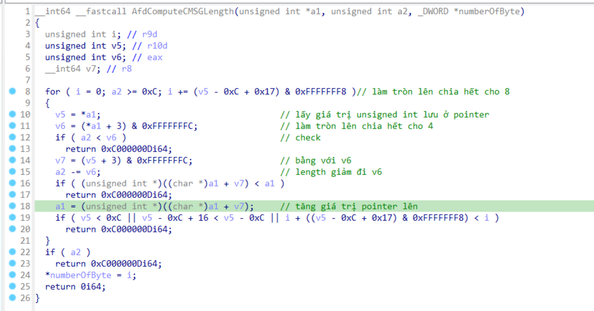
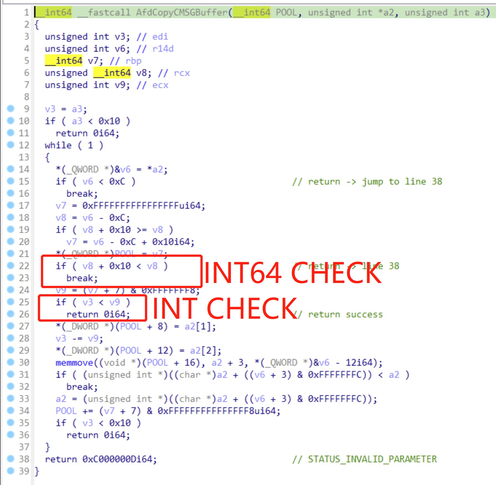
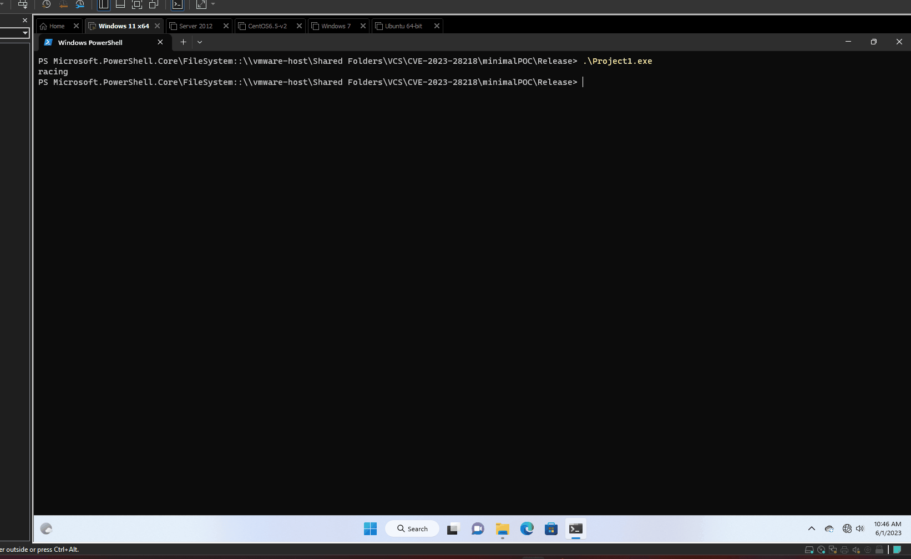
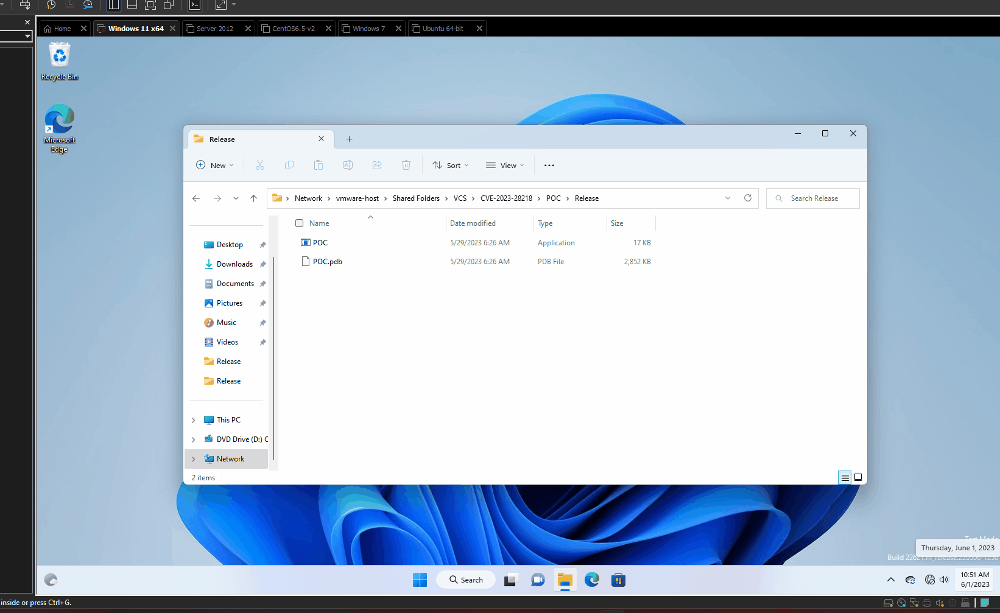

# Report CVE-2023-28218

## Bug overview

Lỗi dẫn tới leo thang đặc quyền trên Windows kernel. Lỗi xuất hiện trong driver `Windows Ancrillary Function Driver for WinSock` (AFD.sys). Lỗi được release trong bản patch ngày 11/04/2023. Có điểm `CVSS:3.1 7.0 / 6.1` và được đánh giá là `Important`. 

## Bug description

- Loại lỗi: `Double fetch` và `Integer overflow` dẫn đến `pool overflow`.
- Lỗi xảy ra trong hàm `Afd!AfdComputeCMSGLength` và `Afd!AfdCopyCMSGBuffer`.

2 hàm này cùng nhận `v82` làm tham số đầu vào. `v82` là một địa chỉ do usermode kiểm soát. Trong hàm `Afd!AfdComputeCMSGLength`, địa chỉ này được tham chiếu trực tiếp để lấy giá trị. Sau đó tính giá trị length của CMSG buffer để return lại. Sau đó một pool sẽ được alloc theo size này. Với việc kiểm soát hai tham số đầu vào là `a1` và `a2` ta có thể kiểm soát được size sẽ được return ở tham số `a3`

Trong hàm `Afd!AfdCopyCMSGBuffer`, địa chỉ `v82` được tham chiếu trực tiếp để lấy giá trị. Qua một vài bước kiểm tra, giá trị này sẽ được dùng để làm size của thao tác `memmove`.

Trong hàm này có một lỗi `Integer overflow`, kết hợp với việc 2 hàm đều fetch trực tiếp từ địa chỉ ở phía usermode, ta có thể thay đổi giá trị của nó trong lúc chạy. Dẫn đến tạo ra giá trị size khi memmove rất lớn. Khi copy đến vùng nhớ không thể truy cập, try catch sẽ xảy ra. Nhưng việc copy những vùng nhớ trước đó đã xảy ra. Qua đó ta có thể copy theo size ý ta muốn.

- Để có thể trigger poc, đầu tiên cần tạo một `socket` với tham số `type` là `SOCK_DGRAM`. Sau đó sử dụng handle của `socket` này để làm tham số gọi hàm `bind`. Cuối cùng là tạo 2 thread, một thread sẽ liên tục gọi đến `DeviceControl` với IOCTL là `0x120D3`. Setup userbuffer phù hợp để bypass một số check. 1 Thread còn lại sẽ liên tục thay đổi giá trị lưu tại địa chỉ usermode mà làm tham số cho 2 hàm kể trên.

## Exploitation

- Với lỗi này, ta có thể overflow một non-paged NX pool với size, và data hoàn toàn có thể kiểm soát được từ phía usermode
- Hướng khai thác sẽ là spray thật nhiều object Namedpipe, sao đó free một số object để tạo các hole trên heap. Sao đó, tạo pool sau khi tính size từ hàm `Afd!AfdComputeCMSGLength`, size này cần trùng với size của `Namedpipe` object. Khi đó, pool sẽ được alloc vào những object vừa bị free. Sử dụng bug để overflow các `Namedpipe` object liền kề, từ đó sử dụng các cơ chế của `Namedpipe` để có quyền read/write bộ nhớ kernel. Đọc token của system process sau đó ghi vào token của process hiện tại.

## Affected range

- Windows Server 2012 R2 (Server Core installation) build trước 6.3.9600.20919
- Windows Server 2012 R2 build trước bản 6.3.9600.20919
- Windows Server 2012 (Server Core installation) build trước bản 6.2.9200.24216
- Windows Server 2012 build trước bản 6.2.9200.24216
- Windows Server 2008 R2 for x64-based Systems Service Pack 1 (Server Core installation) build trước bản 6.1.7601.26466
- Windows Server 2008 R2 for x64-based Systems Service Pack 1 build trước bản 6.1.7601.26466
- Windows Server 2008 for x64-based Systems Service Pack 2 (Server Core installation) build trước bản 6.0.6003.22015
- Windows Server 2008 for x64-based Systems Service Pack 2 build trước bản 6.0.6003.22015
- Windows Server 2008 for 32-bit Systems Service Pack 2 (Server Core installation) build trước bản 6.0.6003.22015
- Windows Server 2008 for 32-bit Systems Service Pack 2 build trước bản 6.0.6003.22015
- Windows Server 2016 (Server Core installation) build trước bản 10.0.14393.5850
- Windows Server 2016 build trước bản 10.0.14393.5850
- Windows 10 Version 1607 for x64-based Systems build trước bản 10.0.14393.5850
- Windows 10 Version 1607 for 32-bit Systems build trước bản 10.0.14393.5850
- Windows 10 for x64-based Systems build trước bản 10.0.10240.19869
- Windows 10 for 32-bit Systems build trước bản 10.0.10240.19869
- Windows 10 Version 22H2 for 32-bit Systems build trước bản 10.0.19045.2846
- Windows 10 Version 22H2 for ARM64-based Systems build trước bản 10.0.19045.2846
- Windows 10 Version 22H2 for x64-based Systems build trước bản 10.0.19045.2846
- Windows 11 Version 22H2 for x64-based Systems build trước bản 10.0.22621.1555
- Windows 11 Version 22H2 for ARM64-based Systems build trước bản 10.0.22621.1555
- Windows 10 Version 21H2 for x64-based Systems build trước bản 10.0.19044.2846
- Windows 10 Version 21H2 for ARM64-based Systems build trước bản 10.0.19044.2846
- Windows 10 Version 21H2 for 32-bit Systems build trước bản 10.0.19044.2846
- Windows 11 version 21H2 for ARM64-based Systems build trước bản 10.0.22000.1817
- Windows 11 version 21H2 for x64-based Systems build trước bản 10.0.22000.1817
- Windows 10 Version 20H2 for ARM64-based Systems build trước bản 10.0.19042.2846
- Windows 10 Version 20H2 for 32-bit Systems build trước bản 10.0.19042.2846
- Windows 10 Version 20H2 for x64-based Systems build trước bản 10.0.19042.2846
- Windows Server 2022 (Server Core installation) build trước bản 10.0.20348.1668
- Windows Server 2022 build trước bản 10.0.20348.1668
- Windows Server 2019 (Server Core installation) build trước bản 10.0.17763.4252
- Windows Server 2019 build trước bản 10.0.17763.4252
- Windows 10 Version 1809 for ARM64-based Systems build trước bản 10.0.17763.4252
- Windows 10 Version 1809 for x64-based Systems build trước bản 10.0.17763.4252
- Windows 10 Version 1809 for 32-bit Systems build trước bản 10.0.17763.4252

## The patch 

- Lỗi đã được vá bằng cách thay thế hai hàm cũ bằng hai hàm mới, các hàm cũ được thêm hộ tố `_old` ở phía sau tên. Các hàm mới này đã. Ở hai hàm mới, tuy vẫn còn double fetch, nhưng giá trị được fetch sẽ được kiểm tra trước khi sử dụng. Các hàm Rtl được sử dụng để thay thế các phép toán, ngăn chặn `Integer overflow`.

## Conclusion

- Bug có affected range rất rộng, đe doạ nhiều hệ thống. Tuy nhiên, payload khai thác khi chạy vẫn có một tỉ lệ nhỏ thất bại dẫn đến crash Windows do việc spray heap. Cùng với đó, sau khi đã leo được quyền của process cmd lên System, nếu exit process này cũng sẽ dẫn đến crash Windows. Do trong quá trình khai thác đã làm corrupt Namedpipe object.

## Attachments

- Minimal POC

- Exploit POC

